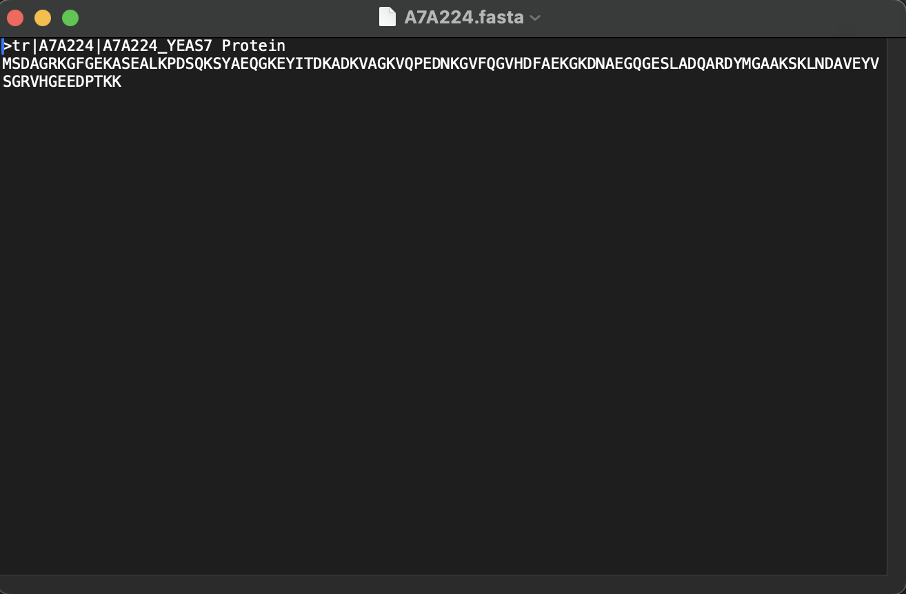
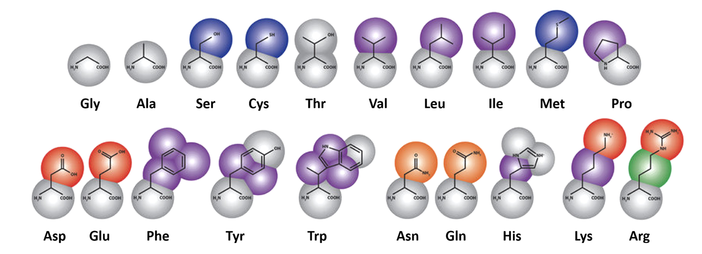
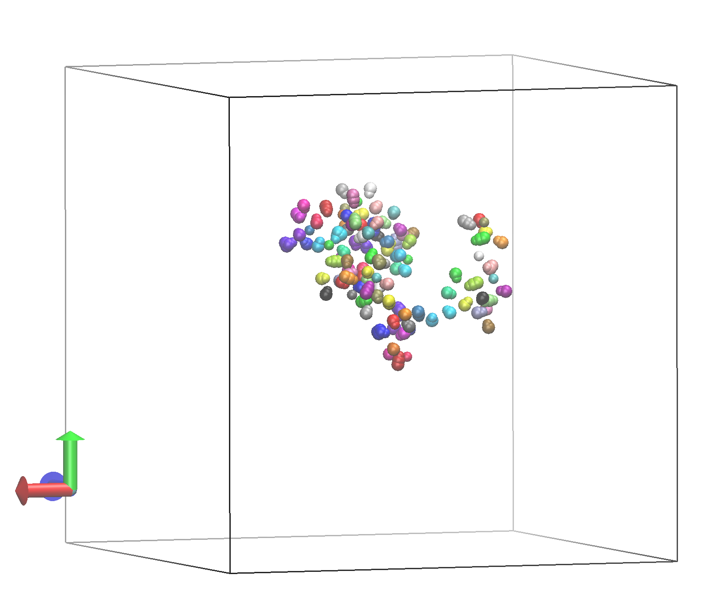

# A brief intro to molecular dynamics 

Molecular dynamics simualtions is a method that predicts the physical movements of atoms and molecules in space and time.

When thinking about the proteins we are focusing on, molecular dynamiccs allows us to get information on a residue-by-residue basis. This is valuble because it is really challenging to experimentally understand what is happening on such a microscopic level. This means that by performing simualtions, we can start to think about how specific patterns in sequence cause changes to different environments. 

# Simulations start from a sequence 
In the `Sequences` folder, you'll see a protein sequence that looks something like this: 

Here, the first line tells us the uniprot code that can be looked up online and the second line tells us the amino acid sequence. 

Using `./SystemPrep.sh` in the Simulations folder, your amino acid sequence is converted from a string to actual coordintes in Cartesian space. However, we are not doing "all atom" simulations, which are computationally expensive. Instead, we are doing coarse-grained simulations with a force field called Martini.

## Coarse-grained simualtions 
Martini simulations are a type of coarse grained simulation.  This means that the complicated details of the molecules are reduced to make the simulations faster. In martini, 4 heavy atoms (anything other than hydrogen) are mappped to 1 bead. This means that all of our sequences will have different bead types, following this diagram: 

[https://pubs.acs.org/doi/10.1021/acs.jctc.2c00140?ref=PDF](Miszta, P. et al. J. Chem. Theory Comput, 2022.)

After running the first few commands in `./SystemPrep.sh`, you will have something that looks like this: 

Looking at this image, does this seem like a good molecular structure? Why? 

