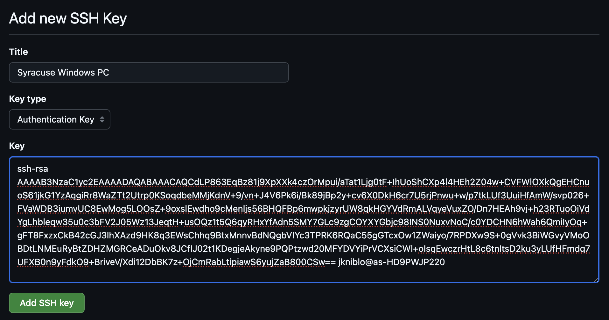
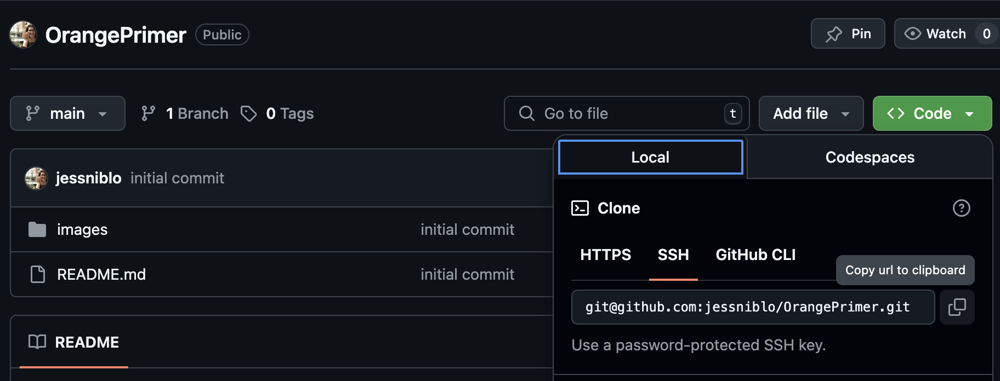

# The Orange Primer 🍊

Welcome to a quick primer on getting setup on Github, Remote Machines, and running simulations!

## GitHub
Github is not only the source of this primer but where you will be able to upload any scripts, data, or other items as you go along!

1. Create a Github Account at https://github.com/ using your Syracuse email address
2. Open finder on your computer and create a new folder in your Documents directory named "Development"
3. Open your the Terminal app on your computer and enter `cd ~/.ssh` and press return, this will navigate you to that folder
    - The `cd` command stands for "Change Directory" and is how you will navigate around your folders. You can see other [helpful commands](##Terminal-Cheat-Sheet) below
4. Run the following command to generate a unique key: `ssh-keygen -b 4096 -t rsa`. This key will be used specifically for connecting to Github
5. Run the following command to output the public version of the unique key to the terminal. You can then highlight and copy it
5. In a browser navigate to https://github.com/settings/keys and click the green  "New SSH Key" button, give the new key a descriptive name like "Syracuse MacBook Key" and paste the key in. Hit the Green "Add SSH Key" button to add it to your account
    
6. Run `cd ~/Documents/Development` to navigate to the development folder you created earlier
7. Click the green "Clone" button at the top of this repository and copy the ssh url
    
8. Enter the following in your terminal `git clone <repolink>` and press return, this will clone the repo locally for you

Congratulations! You now have this repo locally and can begin the next steps of the process!

## Remote Machine Setup
There are two different types of remove machines you'll likely interact with while working here. The first is a High Performance Computing (HPC) system and the second is a Virtual Machine (VM). 

To get on OrangeZest of run jobs, you'll run the following command in the terminal window: 
OrangeZest: `ssh <your-netid>@its-zest-login4.syr.edu`

This will prompt you to enter your password and then grant you access to your home directory on that machine.

We will also use the lab's virtual machine to store our data. To sign in, you'll run: 

TODO: SukenikLab VM: `command`

## Running your first simulation

Go to `Simulations` ([link](https://github.com/jessniblo/OrangePrimer/tree/main/Simulations))

## Terminal Cheat Sheet

| Command / Symbol | Use |
| --- | --- |
| `~` | An alias for your home directory |
| `cd <directory>` | Navigating around folders in the terminal |
| `ls -al` | Lists the contents of your current directory |
| `ssh <username>@<url>` | Allows you to remotely access one of the super computers or virtual machines |