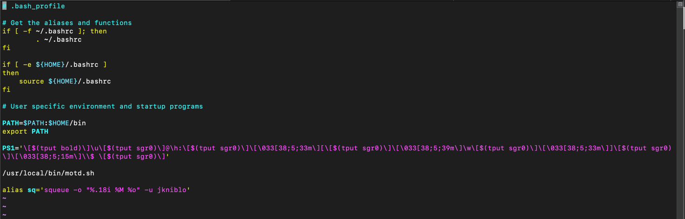
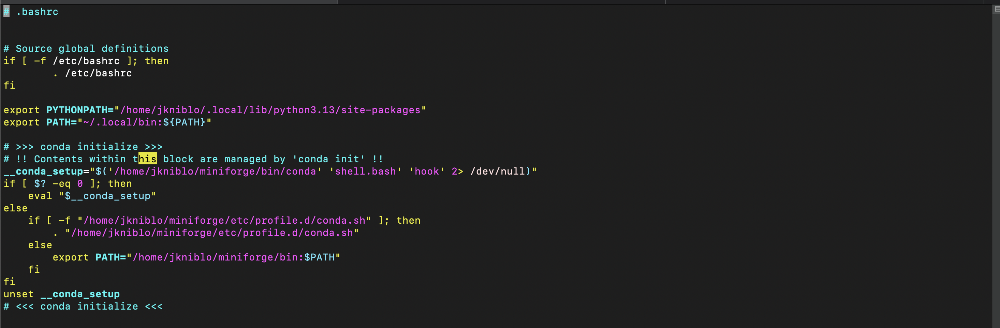

## Simulations 🖥️

Two things are required to run a simulation: 
1. A sequence
2. Some type of environmental condition

## Potential different environments we'll be doing 
1. Salt - 0.05M, 0.15M, and 0.5M NaCl 
2. Temperture - 298K and 315k 
3. pH - acidic 
4. Sugar - trehalose ([and likely more!](https://github.com/marrink-lab/martini-forcefields/blob/main/martini_forcefields/regular/v3.0.0/gmx_files/martini_v3.0.0_sugars_v2.itp))

## Getting onto OrangeZest
OrangeZest: `ssh <your-netid>@its-zest-login4.syr.edu`

## Setting up Anaconda 

We are going to be using conda to store our python libraries that are needed to perform MD simulations.  To install conda, we are going to follow [this how to guide](https://www.anaconda.com/docs/getting-started/miniconda/install), but I've copied the steps here for convience. 

1. type `mkdir software`
2. run `wget https://repo.anaconda.com/miniconda/Miniconda3-latest-Linux-x86_64.sh` 
3. run `bash ~/Miniconda3-latest-Linux-x86_64.sh`
4. there will be a whole bunch of terms to accept 
5. type exit to close your terminal, reopen it, and run `source ~/.bashrc`. 

I'm not 100% sure what this will make your bash profile look like, so lets check. In a terminal window, make sure that your current path is `/home/{NetID}`. Then type `vim ~/.bash_profile`, and it should look like: 

Next, check `vim ~/.bashrc`, and it should look like: 

At this point your HPC system should be ready to go! 

## Getting the files to run a simulation 

We're now going to clone this repo onto Zest so that you can run jobs.  Lets run: 
`git clone git@github.com:jessniblo/OrangePrimer.git`

After this is set up, lets do `cd OrangePrimer/Simulations/salt/NaCl/`

## Submitting a simulation 
Each different condition that you will be simulating has a top level directory that describes the condition (ie - you can see `salt`, and then a sub-directory called `salt/NaCl/` because there is the potential that there are other salts that will someday be interesting.)

To run a simulation, all you need to do is run the command: `./BatchSubmit.sh`.  This will:
1. Create a bunch of subdirectories for each repition and sequence (`salt/NaCl/NaCl_{concentration}/trial#/{sequence}`)
2. Copy all necessary files to the correct folder
3. Submit the job to the slurm manager using `MS_multEquil.slurm`

## Checking on simulation status 

Running the command: 

`squeue -u {NetID}`

will return a list of all the jobs that are currently running. This isn't very helpful because it only states the name of the .slurm file, which will always be the same.  

Running the command: 

`squeue -o "%.18i %M %o" -u {NetID}`

will give you the full path of the `MS_multEquil.slurm` submission, so you can check what is running. 

A good way to tell when your jobs should be done is: 
`tail -n 10 */*/run_prod.out`

This prints out the last 10 lines of a file, and GROMACS prints the estimated completion time at the end of the .out files.
